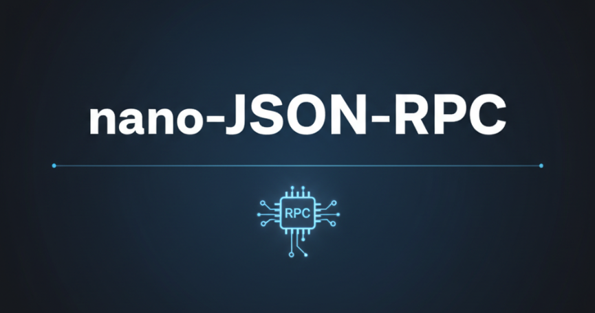

# nano-Json-RPC



一个用 C++ 实现的轻量级 Json-RPC 框架，聚焦简洁 API 与高性能通信，支持同步/异步/回调三种调用方式、服务注册发现与发布订阅。

(in reconstruction process...)

去年的项目文档原文：

- [简单日志宏实现（C++）](https://lvynote.blog.csdn.net/article/details/145249134)
- [\[实现Rpc\] 环境搭建 | JsonCpp | Muduo库 | callBack\(\)](https://lvynote.blog.csdn.net/article/details/145249496)
- [\[实现Rpc\] 项目设计 | 服务端模块划分 | rpc | topic | server](https://lvynote.blog.csdn.net/article/details/145281278)
- [\[实现Rpc\] 客户端划分 | 框架设计 | common类的实现](https://lvynote.blog.csdn.net/article/details/145670874)
- [C++11 异步操作 future类_文档学习](https://lvynote.blog.csdn.net/article/details/145680409)
- [\[实现Rpc\] 通信类抽象层 | function | using | 解耦合设计思想](https://lvynote.blog.csdn.net/article/details/145701259)
- [\[实现Rpc\] 消息抽象层的具体实现](https://lvynote.blog.csdn.net/article/details/145712087)
- [\[实现Rpc\] 消息类型的测试 | dynamic_pointer_cast | gdb使用](https://lvynote.blog.csdn.net/article/details/145726101)
- [\[实现Rpc\] 通信-Muduo库的实现 | && 完美转发 | reserve | unique_lock](https://lvynote.blog.csdn.net/article/details/145755140)
- [\[实现Rpc\] Dispatcher类的实现 | 开闭原则 | 测试 | 传gitee](https://lvynote.blog.csdn.net/article/details/145786287)
- [\[实现Rpc\] 服务端 | RpcRouter实现 | Builder模式](https://lvynote.blog.csdn.net/article/details/145802742)
- [\[实现Rpc\] 客户端 | Requestor | RpcCaller的设计实现](https://lvynote.blog.csdn.net/article/details/145837534)
- [\[实现Rpc\] 测试 | rpc部分功能联调 | debug | 理解bind](https://lvynote.blog.csdn.net/article/details/145850162)


## 核心特性
- C++17 实现，接口简洁、易于嵌入现有服务
- 同步 / `std::future` 异步 / 回调式调用
- 服务注册与发现、心跳下线、负载管理
- 发布订阅（Topic）能力
- 线程安全设计，错误/超时处理完善
- JSON 序列化，默认协议可扩展

## 目录结构
- `source/`：核心代码（client / server / common / test）
- `lib/`：基础库封装
- `build/`：本地构建输出（可自行清理/重建）
- `README.md`：项目说明

## 快速开始
> 依赖：C++17 编译器、CMake（>=3.10）、pthread、jsoncpp（或替换为兼容的 JSON 库）。

```bash
mkdir -p build && cd build
cmake .. -DCMAKE_BUILD_TYPE=Release
make -j
```

构建完成后可在 `source/test/` 中运行示例：
- 注册中心：`test3/reg_server.cpp`
- RPC 服务端：`test3/rpc_server.cpp`
- RPC 客户端：`test3/rpc_client.cpp`

## 使用示例
启动注册中心：
```cpp
Server::RegistryServer reg_server(7777);
reg_server.start();
```

启动 RPC 服务端（可选启用注册中心）：
```cpp
Server::RpcServer server({"127.0.0.1", 6666}, true, {"127.0.0.1", 7777});
server.registerMethod(service);  // service 为已实现的业务对象
server.start();
```

客户端同步/异步调用：
```cpp
Client::RpcClient client(true, "127.0.0.1", 7777);

Json::Value params, result;
client.call("method", params, result);            // 同步

RpcCaller::JsonAsyncResponse fut;
client.call("method", params, fut);               // 异步 future
result = fut.get();

client.call("method", params, [](Json::Value r){  // 回调
    // 处理结果
});
```

发布订阅示例：
```cpp
TopicClient sub("127.0.0.1", 8002);
sub.subscribeTopic("topic1", [](const std::string& msg) {
    // 处理消息
});

TopicClient pub("127.0.0.1", 8002);
pub.publishTopic("topic1", "hello world");
```

## 贡献
欢迎 issue / PR，建议在提交前运行示例测试用例。


